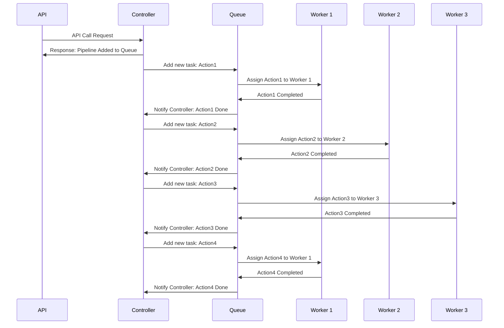

*DRAFT*

---

**Opis**

<p align="center">
  
</p>
<div style="text-align: justify;">

[](https://github.com/PiotrFerenc/mash2/actions/workflows/go.yml)

[](https://sonarcloud.io/summary/new_code?id=PiotrFerenc_mash2)


# Task tower

Task Tower is a tool for automating distributed tasks, utilizing pipelines with isolated processing steps in Docker containers, which allows users to easily scale and modify processes without impacting the entire infrastructure.
 
</div>

## Benefits

- Flexibility in task management
- Process isolation
- Increased operational efficiency
- Ease of integration and collaboration

## How it works


The diagram shows the interactions between different participants in a task processing system. The API receives a request from a user and sends a response that the task has been added to the queue by the controller. Then, the controller adds a new task, labeled Action1, to the queue. The queue assigns this task to Worker 1, who, after completing it, informs the queue that it's done. The queue then notifies the controller that Action1 is complete. The process repeats for the next tasks, Action2 and Action3, which are assigned to Worker 2 and Worker 3, respectively. Each of these tasks is completed and reported as finished to the controller by the respective workers. Finally, Action4 is added to the queue, assigned again to Worker 1, who completes the task and reports its completion. The queue again informs the controller that the task is done.

## Installation 
Linux:
```shell
wget https://raw.githubusercontent.com/PiotrFerenc/mash2/main/install.sh && chmod +x install.sh && ./install.sh
```

Windows:
```shell
Invoke-WebRequest -Uri "https://raw.githubusercontent.com/PiotrFerenc/mash2/main/install.ps1" -OutFile "install.ps1"; .\install.[s1
```


## Build 

### requirements

- [MAKE](https://www.gnu.org/software/make/)
- [docker](https://docs.docker.com/engine/install/)
- [docker-compose](https://docs.docker.com/compose/install/)
- [GO](https://go.dev/doc/install)


  Linux:
```shell
wget https://raw.githubusercontent.com/PiotrFerenc/mash2/main/build.sh && chmod +x build.sh && ./build.sh
```

Windows:
```powershell
Invoke-WebRequest -Uri "https://raw.githubusercontent.com/PiotrFerenc/mash2/main/build.ps1" -OutFile "build.ps1"; Set-ExecutionPolicy -Scope Process -ExecutionPolicy Bypass -Force; ./build.ps1
```

## Usage 

```shell
curl -X POST localhost:5000/execute -H "Content-Type: application/json" -d '{
    "Parameters": {
        "console.text": "hallo word"
    },
    "Tasks": [
        {
            "Sequence": 1,
            "Name": "log",
            "Action": "console"
        }
    ]
}'
```

or
```shell

echo '{
    "Parameters": {
        "console.text": "hallo word"
    },
    "Tasks": [
        {
            "Sequence": 1,
            "Name": "log",
            "Action": "console"
        }
    ]
}' > request.json

curl -X POST localhost:5000/execute -H "Content-Type: application/json" -d @request.json
```
or

[C#](https://github.com/PiotrFerenc/mash2/wiki/C%23), [Go](https://github.com/PiotrFerenc/mash2/wiki/Go), [Rust](https://github.com/PiotrFerenc/mash2/wiki/Rust), [Java](https://github.com/PiotrFerenc/mash2/wiki/Java), [Typescript](https://github.com/PiotrFerenc/mash2/wiki/TypeScript), [PHP](https://github.com/PiotrFerenc/mash2/wiki/PHP), [COBOL](https://github.com/PiotrFerenc/mash2/wiki/COBOL), [Erlang](https://github.com/PiotrFerenc/mash2/wiki/Erlang), [Python](https://github.com/PiotrFerenc/mash2/wiki/Python), [Ruby](https://github.com/PiotrFerenc/mash2/wiki/Ruby), [Scala](https://github.com/PiotrFerenc/mash2/wiki/Scala)


## Actions


## Action: git-clone

**Description:** Clones a git repository to a local path.

**Inputs:**
- **url (text, required):** URL of the git repository to clone.  
  *Display Name:* Git Repository URL

**Outputs:**
- **path (text, required):** Local path where the repository will be cloned to.  
  *Display Name:* Destination Path

---

## Action: git-commit

**Description:** Creates a commit in the git repository.

**Inputs:**
- **path (text, required):** Path to the Git repository.  
  *Display Name:* Repository Path
- **process (text, required):** Message for the Git commit.  
  *Display Name:* Commit Message

**Outputs:**
- **id (text, required):** ID of the Git commit.  
  *Display Name:* Commit ID

---

## Action: git-branch

**Description:** Creates a new branch in the git repository.

**Inputs:**
- **repoPath (text, required):** The path to the local Git repository where the new branch will be created.  
  *Display Name:* Repository Path
- **branchName (text, required):** The name of the new branch to create in the Git repository.  
  *Display Name:* Branch Name

---

## Action: docker-run

**Description:** Runs a Docker container.

**Inputs:**
- **image (text, required):** The name of the Docker image to use.  
  *Display Name:* Image Name
- **e (text, required):** The environment variables for the Docker container.  
  *Display Name:* Environment Variables
- **v (text, required):** Volume.  
  *Display Name:* Environment Variables

**Outputs:**
- **id (text):** The unique identifier for the Docker container.  
  *Display Name:* Container ID

---

## Action: file-append

**Description:** Appends content to a file.

**Inputs:**
- **fileName (text, required):** The name of the file to which content is being appended.  
  *Display Name:* File Name
- **content (text, required):** The content to be appended to the file.  
  *Display Name:* Content

**Outputs:**
- **appendFilePath (text):** The path of the file to which the content will be appended.  
  *Display Name:* Append File Path

---

## Action: console

**Description:** Displays text in the console.

**Inputs:**
- **text (text, required):** Text to display.  
  *Display Name:* 

---

## Action: add-numbers

**Description:** Adds two numbers.

**Inputs:**
- **a (number, required):** First number to be added.  
  *Display Name:* Number A
- **b (number, required):** Second number to be added.  
  *Display Name:* Number B

**Outputs:**
- **c (number):** The result of addition.  
  *Display Name:* Sum

---

## Action: file-create

**Description:** Creates a file with the provided content.

**Inputs:**
- **fileName (text, required):** The name of the file.  
  *Display Name:* File Name
- **content (text, required):** The content to be written to the file.  
  *Display Name:* File Content

**Outputs:**
- **createdFilePath (text):** The path where the new file was created.  
  *Display Name:* Created File Path

---

## Action: file-delete

**Description:** Deletes a file.

**Inputs:**
- **fileName (text, required):** Name of the file to be deleted.  
  *Display Name:* File Name


## Todo 1.0
- [x] Application Programming Interface (API)
- [ ] Monitoring and Logging
- [x] Triggering Tasks
- [x] Handling Distributed Tasks
- [x] Error Management
- [x] Extensibility
- [x] Configuration

## Todo: 2.0
- [ ] CLI
  - prompt
  - list
  - run
- [ ] User Interface (UI)
- [ ] Scheduling
- [ ] Dependency Management of Tasks
- [ ] Retry Mechanisms
- [ ] Security
- [ ] Integration with External Services and Applications

## STATISTICS

[](https://sonarcloud.io/summary/new_code?id=PiotrFerenc_mash2) [](https://sonarcloud.io/summary/new_code?id=PiotrFerenc_mash2) [](https://sonarcloud.io/summary/new_code?id=PiotrFerenc_mash2) [](https://sonarcloud.io/summary/new_code?id=PiotrFerenc_mash2) [](https://sonarcloud.io/summary/new_code?id=PiotrFerenc_mash2) [](https://sonarcloud.io/summary/new_code?id=PiotrFerenc_mash2) [](https://sonarcloud.io/summary/new_code?id=PiotrFerenc_mash2)  [](https://sonarcloud.io/summary/new_code?id=PiotrFerenc_mash2) [](https://sonarcloud.io/summary/new_code?id=PiotrFerenc_mash2) [](https://sonarcloud.io/summary/new_code?id=PiotrFerenc_mash2)

## License

